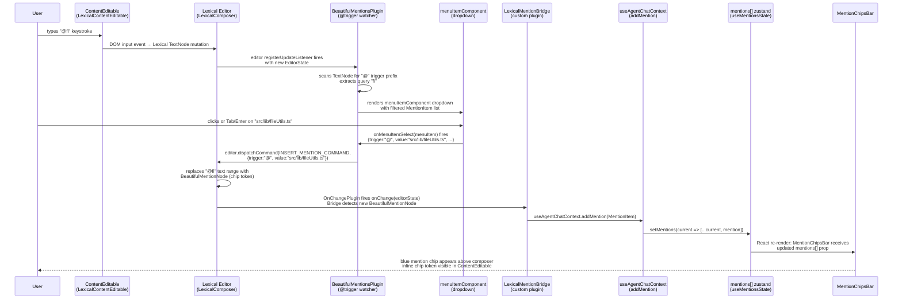

# Wave 81 Phase A Audit — Lexical Composer Engine Migration

**Produced by:** sonnet-architect (Phase A dispatch)
**Date:** 2026-05-02
**Wave plan:** `roadmap/wave-81-composer-engine-migration/waveplan-81.md`
**ADR:** `roadmap/wave-81-composer-engine-migration/wave-81-decisions.md`

> **Orchestrator verification (2026-05-03):** All API names in §2 below were spot-checked against Context7 (`/sodenn/lexical-beautiful-mentions`) after the architect's research session. `onMenuItemSelect`, `onMenuOpen`, `onMenuClose`, and `BeautifulMentionsMenuItemProps` shape (`selected`, `item`, `children`) all confirmed against current docs. Architect's WebFetch-based source-file research is therefore endorsed.

---

## 1. Sequence Diagram — Chat-Only Composer Keystroke Path



**Site 1 terminus (non-negotiable):** The diagram ends at a user-observable terminus. The locked terminus per the wave plan is: "chat-only composer textarea visually reflects an inserted blue mention chip after `@` selection in a live IDE chat-only window with `VITE_LEXICAL_COMPOSER=1` set." Cole confirms this by running `npm run dev` with the flag set.

The two observable signals at terminus:
1. An inline blue chip token appears inside the ContentEditable at the insertion point.
2. A chip appears in `MentionChipsBar` above the composer (driven by `mentions[]` store update).

Both must be visible simultaneously for the terminus to be satisfied.

---

## 2. API-Surface Verification

**Verification provenance:** The architect's session reported Context7 MCP tools unavailable and used direct GitHub raw source fetches (`raw.githubusercontent.com/sodenn/lexical-beautiful-mentions/main/plugin/src/*`) plus WebSearch as the substitute. The orchestrator subsequently spot-checked the load-bearing claims (`onMenuItemSelect`, `BeautifulMentionsMenuItemProps`, `onMenuOpen`/`onMenuClose`) against Context7 (`/sodenn/lexical-beautiful-mentions`) on 2026-05-03 and confirmed all match. Sources are cited per sub-section.

---

### 2a. `BeautifulMentionsPlugin` trigger-selection callback

**Verified name: `onMenuItemSelect`**

From the plugin source (`plugin/src/BeautifulMentionsPlugin.tsx`, destructured props):

```typescript
onMenuItemSelect?: (menuItem: BeautifulMentionsMenuItem) => void
```

Where `BeautifulMentionsMenuItem` is (from `plugin/src/BeautifulMentionsPluginProps.ts`):

```typescript
export interface BeautifulMentionsMenuItem {
  trigger: string;
  value: string;
  displayValue: string;
  data?: Record<string, BeautifulMentionsItemData>;
}
```

Context7 confirms the canonical usage: `onMenuItemSelect={(item) => console.log("Selected:", item)}` (Basic BeautifulMentionsPlugin Setup snippet).

**Resolution of ambiguity:** `onMentionsChange` is a prop on `react-mentions-ts` (a different library). `onSelectOption` does not appear in `lexical-beautiful-mentions`. The correct prop name is `onMenuItemSelect`. Phase C must use this name exclusively.

Also confirmed: `onMenuOpen?: () => void` and `onMenuClose?: () => void` are available as optional props on `BeautifulMentionsPlugin` — useful for Phase C's close-on-blur behavior.

---

### 2b. Programmatic mention insertion API

**Verified API: `useBeautifulMentions().insertMention(options)` dispatches `INSERT_MENTION_COMMAND`**

From `plugin/src/useBeautifulMentions.ts`:

```typescript
const {
  getMentions,      // () => Array<{ trigger: string; value: string; data: unknown }>
  insertMention,    // (options: InsertMention) => void
  removeMentions,   // (options: RemoveMentions) => void
  renameMentions,   // (options: RenameMentions) => void
  hasMentions,      // (options: HasMentions) => boolean
  openMentionMenu,  // (options: OpenMentionMenu) => void
} = useBeautifulMentions();
```

`InsertMention` type (from `plugin/src/mention-commands.ts`):

```typescript
export interface InsertMention {
  trigger: string;   // e.g. "@"
  value: string;     // e.g. "src/lib/fileUtils.ts"
  focus?: boolean;   // default: true
  data?: Record<string, BeautifulMentionsItemData>;
}

export const INSERT_MENTION_COMMAND: LexicalCommand<InsertMention> =
  createCommand("INSERT_MENTION_COMMAND");
```

`insertMention` internally dispatches `INSERT_MENTION_COMMAND` to the editor. Phase E's drag-from-FileTree drop handler must call `useBeautifulMentions().insertMention({ trigger: "@", value: mention.path })` from a React component that is a descendant of `LexicalComposer`, OR call `editor.dispatchCommand(INSERT_MENTION_COMMAND, payload)` from any code that has an editor reference.

**Critical note for Phase E:** `useBeautifulMentions` must be called from within a component that is a descendant of `LexicalComposer`. The custom drop handler component must be mounted inside the composer tree (see Risk 9.3).

---

### 2c. Backspace-into-mention removal hook

**Verified approach: `OnChangePlugin` + `getMentions()` diff, NOT a dedicated removal callback**

`lexical-beautiful-mentions` does not expose a dedicated `onMentionRemove` or backspace callback. The correct pattern is:

1. Register an `OnChangePlugin` (or `editor.registerUpdateListener`) that calls `getMentions()` on each state change.
2. Diff the returned mentions list against the previous list to detect removals.
3. On removal detected, call `useAgentChatContext.removeMention(key)`.

The `BeautifulMentionNode` is removed from the editor state when the user backspaces into the chip — Lexical handles this natively. The bridge only needs to observe the resulting state change.

**Phase C implementation note:** The bridge component should maintain a `prevMentionsRef` and compare `getMentions()` results on every `OnChangePlugin` callback to detect removed chips.

---

### 2d. `menuItemComponent` prop signature

**Verified:** `BeautifulMentionsMenuItemProps`:

```typescript
export type BeautifulMentionsMenuItemProps = Omit<
  ComponentPropsWithRef<any>,
  "selected" | "label"
> & {
  selected: boolean;
  label: string;        // NOTE: deprecated as of ~0.1.47 — use item.displayValue instead
  itemValue: string;    // NOTE: deprecated — use item.value instead
  item: BeautifulMentionsMenuItem;  // { trigger, value, displayValue, data? }
};
```

Context7 confirms via the "Custom Menu and Menu Item Components for Mentions" snippet:

```tsx
const CustomMenuItem = forwardRef<HTMLLIElement, BeautifulMentionsMenuItemProps>(
  ({ selected, item, children, ...props }, ref) => {
    const { trigger, value, data } = item;
    // ...
  }
);
```

**Deprecation alert:** The `label` and `itemValue` props on `BeautifulMentionsMenuItemProps` were deprecated in a refactor merged ~October 2024. Phase C should use `item.displayValue` and `item.value` instead of the deprecated shims to stay forward-compatible.

**Usage in Phase C:** The `menuItemComponent` prop on `BeautifulMentionsPlugin` receives a React component of this shape. Phase C re-uses `MentionAutocomplete.tsx`'s `MentionResult` styling — the custom `menuItemComponent` will receive `item: BeautifulMentionsMenuItem` and maps `item.value` to the file path for display.

---

### 2e. `@lexical/react` command priority constants

**Verified:** All priority constants are exported from `'lexical'` (core package), NOT from `'@lexical/react'`.

```typescript
import {
  COMMAND_PRIORITY_EDITOR,    // lowest — default for editor's own built-ins
  COMMAND_PRIORITY_LOW,       // 1
  COMMAND_PRIORITY_NORMAL,    // 2
  COMMAND_PRIORITY_HIGH,      // 3
  COMMAND_PRIORITY_CRITICAL,  // 4 — highest
} from 'lexical';
```

Dispatch order: `COMMAND_PRIORITY_CRITICAL` → `HIGH` → `NORMAL` → `LOW` → `EDITOR`. Listeners at higher priority run first; returning `true` from a listener stops propagation to lower-priority listeners. Registration order within the same priority level is last-registered-called-first as of v0.44.0.

**Wave plan risk mitigation:** The slash plugin registers at `COMMAND_PRIORITY_LOW`. `BeautifulMentionsPlugin` internally registers at `COMMAND_PRIORITY_NORMAL` (consistent with using the default for most plugins). The slash plugin therefore runs after `BeautifulMentionsPlugin` claims `@` triggers — correct ordering is maintained without registration-order dependency.

Source: lexical.dev/docs/concepts/commands.

---

### 2f. `PASTE_COMMAND` / `KEY_ENTER_COMMAND` / `KEY_ARROW_UP_COMMAND` — import paths and registration

All three commands are imported from `'lexical'`:

```typescript
import {
  PASTE_COMMAND,
  KEY_ENTER_COMMAND,
  KEY_ARROW_UP_COMMAND,
  KEY_BACKSPACE_COMMAND,
  COMMAND_PRIORITY_HIGH,
  COMMAND_PRIORITY_LOW,
  COMMAND_PRIORITY_EDITOR,
} from 'lexical';
```

Registration pattern:

```typescript
import { useEffect } from 'react';
import { useLexicalComposerContext } from '@lexical/react/LexicalComposerContext';

export function ChatKeyboardPlugin(props: { onSend: () => void }) {
  const [editor] = useLexicalComposerContext();
  useEffect(() => {
    return editor.registerCommand(
      KEY_ENTER_COMMAND,
      (event: KeyboardEvent | null) => {
        if (!event || event.shiftKey || event.isComposing) return false;
        event.preventDefault();
        props.onSend();
        return true;
      },
      COMMAND_PRIORITY_LOW,  // low so BeautifulMentionsPlugin (NORMAL) handles dropdown Enter first
    );
  }, [editor, props.onSend]);
  return null;
}
```

**IME guard:** `event.isComposing` must be checked in the `KEY_ENTER_COMMAND` handler. When `isComposing === true`, return `false` immediately without calling `onSend`. This is the direct Lexical equivalent of the existing `handleEnterShortcut` guard in `AgentChatComposerKeyHandlers.ts`.

**Paste interception:** Phase E's image paste plugin must register at `COMMAND_PRIORITY_HIGH` to run before Lexical's internal paste-to-text handler:

```typescript
return editor.registerCommand(
  PASTE_COMMAND,
  (event: ClipboardEvent) => {
    const imageFiles = Array.from(event.clipboardData?.items ?? [])
      .filter(item => item.type.startsWith('image/'))
      .map(item => item.getAsFile())
      .filter((f): f is File => f !== null);
    if (!imageFiles.length) return false; // let Lexical handle text paste
    event.preventDefault();
    void handlePaste(imageFiles);
    return true;
  },
  COMMAND_PRIORITY_HIGH,
);
```

Source: lexical.dev/docs/concepts/commands; github.com/facebook/lexical/discussions/5112.

---

### 2g. React 19 compatibility

**Verified: React 19 is supported. Pin to `lexical-beautiful-mentions@0.1.48`.**

From `plugin/package.json`:

```json
"peerDependencies": {
  "lexical": ">=0.11.0",
  "@lexical/react": ">=0.11.0",
  "@lexical/utils": ">=0.11.0",
  "react": ">=17.x",
  "react-dom": ">=17.x"
}
```

This project uses React 19 (confirmed from `C:\Web App\Agent IDE\package.json`). React 19 satisfies the `>=17.x` constraint.

**Pinned version for Phase B:** `lexical-beautiful-mentions@0.1.48` — the latest stable release as of 2026-05-02. The wave-plan risk row's fallback path (custom mention plugin on raw Lexical primitives, ~1 day) is NOT triggered.

Source: github.com/sodenn/lexical-beautiful-mentions/releases.

---

### 2h. Plain-text editor setup — canonical pattern

```typescript
import { LexicalComposer } from '@lexical/react/LexicalComposer';
import { PlainTextPlugin } from '@lexical/react/LexicalPlainTextPlugin';
import { ContentEditable } from '@lexical/react/LexicalContentEditable';
import { HistoryPlugin } from '@lexical/react/LexicalHistoryPlugin';
import { OnChangePlugin } from '@lexical/react/LexicalOnChangePlugin';
import { LexicalErrorBoundary } from '@lexical/react/LexicalErrorBoundary';
import { BeautifulMentionNode, BeautifulMentionsPlugin } from 'lexical-beautiful-mentions';
import { $getRoot, type EditorState } from 'lexical';

const initialConfig = {
  namespace: 'ChatComposer',
  theme: {},
  nodes: [BeautifulMentionNode],  // register mention node
  onError: (error: Error) => console.error(error),
};

function LexicalChatComposer({ onChange }: { onChange: (text: string) => void }) {
  return (
    <LexicalComposer initialConfig={initialConfig}>
      <PlainTextPlugin
        contentEditable={
          <ContentEditable
            aria-label="Chat composer"
            aria-multiline="true"
            role="textbox"
          />
        }
        placeholder={<div>Ask the agent...</div>}
        ErrorBoundary={LexicalErrorBoundary}
      />
      <HistoryPlugin />
      <OnChangePlugin
        onChange={(editorState: EditorState) => {
          editorState.read(() => {
            onChange($getRoot().getTextContent());
          });
        }}
      />
      <BeautifulMentionsPlugin triggers={["@"]} onSearch={searchMentions} />
      <ChatKeyboardPlugin onSend={...} />
    </LexicalComposer>
  );
}
```

**Critical:** `BeautifulMentionNode` must be included in `initialConfig.nodes` or the plugin will throw at mount time.

Source: lexical.dev/docs/packages/lexical-react.

---

## 3. Integration-Seam Enumeration

| File | Classification | Notes |
|---|---|---|
| `AgentChatComposerInput.tsx` | **Substantially rewritten** | Branching mount point for the flag; full rewrite in Phase F |
| `AgentChatComposer.tsx` | **Stays unchanged** | Parent composer; props-down model unchanged |
| `AgentChatComposerKeyHandlers.ts` | **Retires** | Ports into `ChatKeyboardPlugin.tsx` under `lexicalComposer/` |
| `AgentChatComposerHooks.ts` | **Bridges to Lexical (partial)** | See below |
| `MentionAutocomplete.tsx` + `MentionAutocompleteSupport.ts` | **Stays unchanged** | Styling/icons re-used in Phase C `menuItemComponent` |
| `SlashCommandMenu.tsx` | **Stays unchanged** | UI preserved; driven by `SlashCommandPlugin.ts` in Phase D |
| `useAgentChatContext.ts` | **Stays unchanged** | `addMention(mention: MentionItem)` and `removeMention(key: string)` are bridge targets |
| `useAgentChatDraftPersistence.ts` | **Bridges to Lexical** | See below |
| `AgentChatComposerInput.test.tsx` | **Substantially rewritten** | Phase F rewrites against Lexical surface |
| `AgentChatComposerSupport.ts` | **Retires (partial)** | See below |
| `AgentChatComposer/CLAUDE.md` | **Stays unchanged** | Phase F appends a Lexical migration gotcha entry |

### Detailed seam notes

**`AgentChatComposerInput.tsx` — Substantially rewritten**

Phase B: Add `import.meta.env.VITE_LEXICAL_COMPOSER === '1'` branch in `ComposerTextarea`. When flag is on, render `<LexicalChatComposer .../>` instead of `<RichTextarea .../>`. The `ComposerInput` wrapper div (with `SendButton`, `MidTurnInjectButton`, `PickImageButton`) stays in place — only the textarea engine swaps.

```typescript
function ComposerTextarea(props: ComposerInputProps): React.ReactElement {
  if (import.meta.env.VITE_LEXICAL_COMPOSER === '1') {
    return <LexicalChatComposer ... />;
  }
  // existing RichTextarea path
}
```

Phase F: Remove the branch; `LexicalChatComposer` renders unconditionally; RichTextarea path deleted.

**`AgentChatComposerKeyHandlers.ts` — Retires**

All logic ports to `lexicalComposer/ChatKeyboardPlugin.tsx`. Specific mappings:

- `handleEnterShortcut` → `editor.registerCommand(KEY_ENTER_COMMAND, ...)` at `COMMAND_PRIORITY_LOW`. Guard: `event.isComposing === true` → return `false`.
- `handleEscapeShortcut` → `editor.registerCommand(KEY_ESCAPE_COMMAND, ...)`. Clear via `editor.update(() => { $getRoot().clear(); })`.
- `handleArrowUpShortcut` → `editor.registerCommand(KEY_ARROW_UP_COMMAND, ...)`. Gating: check `$getRoot().getTextContent().trim() === ''` AND caret at position 0 (`$getSelection()?.anchor.offset === 0`).
- `handlePermissionModeShortcut` (Shift+Tab) → `editor.registerCommand(KEY_TAB_COMMAND, ...)`. Check `event.shiftKey`.
- `handleAutocompleteKeyDown` — replaced by `BeautifulMentionsPlugin`'s built-in keyboard handling for `@` dropdown. Slash command keyboard handling moves to `SlashCommandPlugin.ts` (Phase D).

The original file should not be deleted until Phase F when the flag branch is removed.

**`AgentChatComposerHooks.ts` — Bridges to Lexical (partial)**

- `useComposerDraftSync` — **retires for the Lexical path.** Draft sync is handled by `OnChangePlugin` in `LexicalChatComposer`.
- `useQuoteListener` — **bridges to Lexical.** On `agent-ide:quote-to-composer` event, call `editor.update(() => { const textNode = $createTextNode(detail.text); $getRoot().selectEnd().insertNodes([textNode]); })`.
- `useImageAttachmentHandlers` — **stays, bridges to Lexical.** Phase E wraps `handlePaste` in a `PASTE_COMMAND` listener; `handleDrop`/`handleDragOver`/`handleDragLeave` re-attach to the `LexicalChatComposer` wrapper div.
- `useComposerDraftHandlers` / `useComposerMenuState` — **retire for the Lexical path.** Menu state is internal to `BeautifulMentionsPlugin` and `SlashCommandPlugin`.

Bridge call sites for `useAgentChatContext`:
- `addMention(mention: MentionItem)`: called from `LexicalMentionBridge` on `onMenuItemSelect` callback OR `OnChangePlugin` diff detecting new `BeautifulMentionNode`.
- `removeMention(key: string)`: called from `LexicalMentionBridge` on `OnChangePlugin` diff detecting removed `BeautifulMentionNode`.

**`useAgentChatDraftPersistence.ts` — Bridges to Lexical**

The existing hook uses `textareaRef.current.value` for reading/writing draft text. In the Lexical path:
- **Read** (draft to editor on mount/thread-switch): `editor.update(() => { const root = $getRoot(); root.clear(); root.append($createParagraphNode().append($createTextNode(storedDraft))); })`.
- **Write** (editor to storage on change): `OnChangePlugin` fires `(editorState) => { editorState.read(() => { const text = $getRoot().getTextContent(); debouncedSave(text); }); }`.

The `clearPersistedDraft(threadId)` and `isDraftThreadId()` utilities are unchanged — they operate on localStorage keys only.

**`AgentChatComposerSupport.ts` — Retires (partial)**

- `tokenizeComposerHighlights` / `renderHighlights` / `isComposerMentionHighlight` — **retire.** Lexical renders mention chips via `BeautifulMentionNode` natively.
- `buildMentionInsertion` / `replaceTriggerWithPath` / `removeTriggerBeforeCursor` — **retire for Lexical path.** Programmatic insertion goes through `useBeautifulMentions().insertMention()`.
- `replaceSlashTrigger` — **ports to `SlashCommandPlugin.ts`** as an `editor.update()` + `TextNode` mutation.
- `selectComposerMention` / `selectComposerFile` — **retire.** `BeautifulMentionsPlugin` handles selection internally.
- `selectComposerSlash` / `runComposerSlashCommand` — **ports to `SlashCommandPlugin.ts`**.
- `buildMentionFromDrop` (in `AgentChatComposerHooks.ts`) — **stays.** JSON parsing logic reused in Phase E's drop handler.
- `getTextareaStyle` — **retires.** CSS on ContentEditable container replaces inline style.
- `setDraftValue` / `resetDraftTextarea` — **retire for Lexical path.**

---

## 4. ContentEditable vs Textarea Geometry — Drop and Positioning Reshape

### 4a. Drag-from-FileTree Drop Handler

**Current implementation** (`src/renderer/components/AgentChat/AgentChatComposerHooks.ts` lines 87-101):

The `handleDrop` handler is attached to `AgentChatComposer`'s `FloatingComposerContainer` wrapper div (via `attachmentHandlers.handleDrop`). It already operates on the container element, not on `<textarea>` directly.

**Reshape for Lexical (Phase E):**

The `FloatingComposerContainer` already carries the `onDrop` handler — this propagation path stays. Inside the handler, replace `insertDroppedPath(textareaRef, ...)` with:

```typescript
const mention = buildMentionFromDrop(jsonData);
if (mention) {
  editorRef.current?.dispatchCommand(INSERT_MENTION_COMMAND, {
    trigger: '@',
    value: mention.path,
    focus: true,
  });
  onAddMention?.(mention);
}
```

The `INSERT_MENTION_COMMAND` is exported from `lexical-beautiful-mentions` and can be dispatched directly without needing to be inside a React component. The `editorRef` is obtained via a custom child plugin that calls `useLexicalComposerContext()` and exposes the editor instance to the outer scope.

**Drop event propagation:** ContentEditable does receive `drop` events on the editable region. Since the drop handler is already on the parent div (not on `<textarea>` itself), no change to event attachment is required.

### 4b. `MidTurnInjectButton` Absolute-Positioning Anchor

**Current implementation** (`src/renderer/components/AgentChat/AgentChatComposerInput.tsx` lines 179-197):

`MidTurnInjectButton` positions with `position: absolute; top: 6px; right: 38px;` — relative to the `<div className="relative">` wrapper in `ComposerInput` (line 306), NOT relative to the `<textarea>` element. The wrapper div establishes the positioning context.

The `LexicalChatComposer` will be placed inside this same `<div className="relative">` wrapper — replacing only `<ComposerTextarea>`. Since the positioning context is the wrapper div, the offsets will work identically as long as `LexicalChatComposer` renders a root `<div>` (or ContentEditable) that starts at the same top-left origin inside the wrapper.

**Recommendation for Phase E:** No wrapper shim div is needed initially. Verify by measuring `MidTurnInjectButton.getBoundingClientRect()` relative to the composer's top edge in the Phase E smoke — if the button visually shifts more than 2px, add a `min-height: 40px` constraint to the ContentEditable's wrapper div to match the `RichTextarea`'s minimum height.

**`SendButton` and `StopButton`:** Also positioned with `top: 6px; right: 8px` / `right: 2px` — same analysis applies. No repositioning needed.

---

## 5. Slash-Command Plugin Strategy

### 5a. Registration Priority

The `SlashCommandPlugin.ts` registers its editor state listener via `editor.registerUpdateListener` (which is not priority-ranked). For any command listeners (e.g., `KEY_ENTER_COMMAND` to confirm slash selection), use **`COMMAND_PRIORITY_LOW`** so `BeautifulMentionsPlugin` (which operates at `COMMAND_PRIORITY_NORMAL`) handles `@` Enter first.

The slash plugin only reads state and sets external React state (the `SlashCommandMenu`'s `isOpen` / `slashQuery` props), so there is no race condition with `BeautifulMentionsPlugin`'s internal state management.

### 5b. Editor-State Read Pattern

Safe cursor-position and text scanning inside an `updateListener`:

```typescript
editor.registerUpdateListener(({ editorState }) => {
  editorState.read(() => {
    const selection = $getSelection();
    if (!$isRangeSelection(selection) || !selection.isCollapsed()) {
      setIsSlashMenuOpen(false);
      return;
    }
    const anchor = selection.anchor;
    const node = anchor.getNode();
    if (!$isTextNode(node)) {
      setIsSlashMenuOpen(false);
      return;
    }
    const fullText = $getRoot().getTextContent();
    const absoluteOffset = computeAbsoluteOffset($getRoot(), anchor);
    const slashQuery = extractSlashQuery(fullText, absoluteOffset);
    if (slashQuery !== null) {
      setSlashQuery(slashQuery);
      setIsSlashMenuOpen(true);
    } else {
      setSlashQuery(null);
      setIsSlashMenuOpen(false);
    }
  });
});
```

`extractSlashQuery` is imported unchanged from `AgentChatComposerSupport.ts`. Its signature: `extractSlashQuery(value: string, cursorPos: number): string | null`.

`computeAbsoluteOffset` is a small helper that walks the root's text descendants to find the absolute character offset of `anchor.offset` in `node` within the full root text. For a single-paragraph plain-text composer this simplifies to `anchor.offset` directly — but Phase D MUST implement the multi-paragraph-safe version (see Risk 9.5).

Imports needed:
```typescript
import { $getRoot, $getSelection, $isRangeSelection, $isTextNode } from 'lexical';
```

### 5c. Selection Callback Shape — Slash Command Action

When the user selects a slash command:

```typescript
// Option 1: command clears draft (cmd.clearDraft !== false)
editor.update(() => {
  const root = $getRoot();
  root.clear();
  root.append($createParagraphNode());
});

// Option 2: command inserts /cmdId text (cmd.clearDraft === false)
editor.update(() => {
  const root = $getRoot();
  root.clear();
  const paragraph = $createParagraphNode();
  paragraph.append($createTextNode(`/${cmd.id} `));
  root.append(paragraph);
});
```

The `runComposerSlashCommand` logic from `AgentChatComposerSupport.ts` (special handling for `/remember`, `/diff`, `/spec`) ports into the `onSlashSelect` callback — logic unchanged, only the draft mutation uses `editor.update()` instead of `setDraftValue(textareaRef, ...)`.

Required imports:
```typescript
import { $createParagraphNode, $createTextNode, $getRoot } from 'lexical';
```

---

## 6. IME / RTL / Composition Test Cases

### Phase B unit tests (`LexicalChatComposer.test.tsx`)

1. **IME Enter suppression:** Fire `keydown` event with `{ key: 'Enter', isComposing: true }` on the editor. Assert `onSend` is NOT called. Validates the `event.isComposing` guard in `ChatKeyboardPlugin`.

2. **IME Enter after composition:** Fire `compositionstart`, then `keydown` with `isComposing: true` (no send), then `compositionend`, then `keydown` with `{ key: 'Enter', isComposing: false }`. Assert `onSend` IS called on the second Enter.

3. **ArrowUp gating — mid-text:** Set editor content to "hello world", fire `KEY_ARROW_UP_COMMAND`. Assert `onRestoreLastMessage` is NOT called (caret not at position 0).

4. **ArrowUp gating — empty draft at start:** Editor empty, fire `KEY_ARROW_UP_COMMAND` with selection at offset 0. Assert `onRestoreLastMessage` IS called.

5. **Shift-Enter newline:** Fire `keydown` with `{ key: 'Enter', shiftKey: true }`. Assert `onSend` is NOT called and a newline is inserted in the editor.

### Phase F manual smoke (IME / RTL)

6. **Asian-language input (Windows IME):** Enable Japanese or Chinese IME. Type `@` → type a romaji query → confirm dropdown opens → press Enter to confirm IME composition → confirm a second Enter sends (does not double-send). Verify no double-send and no stutter during IME sequence.

7. **RTL text (Hebrew/Arabic):** Paste Hebrew/Arabic text into the composer. Verify caret tracking works (ArrowUp from end of RTL text does NOT trigger restore-last-message). Verify send works.

8. **Screen reader ARIA:** Confirm `ContentEditable` has `aria-label`, `aria-multiline="true"`, and `role="textbox"`. Verify with NVDA on Windows if available; otherwise verify attributes programmatically via DOM inspection.

**Required ARIA attributes for `LexicalComposer`'s `ContentEditable`:**

```tsx
<ContentEditable
  aria-label="Ask the agent... (/ for commands, @ to mention files)"
  aria-multiline="true"
  role="textbox"
  aria-disabled={props.disabled}
/>
```

---

## 7. Environment Variable Setup — `VITE_LEXICAL_COMPOSER`

### How VITE_* flags work in this project

`electron-vite` uses Vite for the renderer. `VITE_*`-prefixed env vars are injected at build time and accessible via `import.meta.env.VITE_*` in renderer code. Existing pattern: `VITE_APP_VERSION` is declared in `src/renderer/env.d.ts`.

**Phase B MUST add `VITE_LEXICAL_COMPOSER` to `env.d.ts`:**

```typescript
interface ImportMetaEnv {
  readonly VITE_APP_VERSION: string;
  readonly VITE_LEXICAL_COMPOSER?: string;  // "1" to enable Lexical path
}
```

### Setting the flag for dev (Cole's Windows PowerShell shell)

```powershell
$env:VITE_LEXICAL_COMPOSER = "1"
npm run dev
```

Or inline:

```powershell
$env:VITE_LEXICAL_COMPOSER = "1"; npm run dev
```

**Note:** The env var must be set before `npm run dev` starts — it is injected at build time by electron-vite's Vite step, not at runtime. Restarting the dev server picks up the new value.

**Branching check in source:**

```typescript
if (import.meta.env.VITE_LEXICAL_COMPOSER === '1') {
  return <LexicalChatComposer ... />;
}
```

There is no `import.meta.env.DEV` guard needed — the flag works in both dev and prod builds. Phase F removes it unconditionally.

---

## 8. Pre-Wave / Post-Wave Bundle-Size Baseline

### Capture command (before Phase B installs dependencies)

```powershell
npm run build
$baselineBytes = (Get-ChildItem -Recurse "out\renderer" | Measure-Object -Property Length -Sum).Sum
Write-Host "Pre-wave renderer bundle: $baselineBytes bytes"
```

Record `$baselineBytes` before Phase B's `npm install`.

### Post-wave capture (after Phase F)

```powershell
npm run build
$postBytes = (Get-ChildItem -Recurse "out\renderer" | Measure-Object -Property Length -Sum).Sum
$deltaKb = [math]::Round(($postBytes - $baselineBytes) / 1024, 1)
Write-Host "Post-wave renderer bundle: $postBytes bytes (delta: $deltaKb KB)"
```

### Expected component breakdown (estimates)

| Package | Est. uncompressed | Est. gzipped |
|---|---|---|
| `lexical` core | ~350 KB | ~80 KB |
| `@lexical/react` | ~120 KB | ~25 KB |
| `lexical-beautiful-mentions` | ~75 KB | ~15 KB |
| `rich-textarea` (removed) | ~80 KB | ~18 KB |
| **Net delta** | **~+465 KB raw** | **~+102 KB gz** |

The wave plan's ±200 KB threshold applies to the **gzipped** delta (~102 KB gz net increase is within threshold). The raw uncompressed delta (~465 KB) is expected to be larger. If the renderer bundle raw delta exceeds 700 KB, investigate whether the full Lexical tree-shaking is working in electron-vite's Vite config.

The `npm run build:analyze` script (`ANALYZE='true'` flag in `package.json` scripts) can produce a Vite bundle visualization to verify tree-shaking of Lexical packages.

---

## 9. Risks Surfaced Beyond the Wave Plan's Risk Table

### Risk 9.1: `env.d.ts` requires `VITE_LEXICAL_COMPOSER` declaration — Phase B blocker if missed

`src/renderer/env.d.ts` currently only declares `VITE_APP_VERSION`. If `VITE_LEXICAL_COMPOSER` is not added to `ImportMetaEnv`, `import.meta.env.VITE_LEXICAL_COMPOSER` will be typed as `never` and the branch condition will always evaluate to false at the type level (and may produce a TypeScript error).

**Mitigation:** Phase B implementer adds the declaration as part of the initial feature-flag commit. **Orchestrator action:** flag this to Phase B implementer in dispatch brief.

### Risk 9.2: `BeautifulMentionNode` must be registered in `LexicalComposer.nodes[]` — silent runtime failure if omitted

If `BeautifulMentionNode` is not included in `initialConfig.nodes`, the plugin will fail with `LexicalError: Class marked as @lexical is not registered on the editor` when attempting to insert a mention. Easy to miss without error boundary logging.

**Mitigation:** Phase B's `LexicalChatComposer` initial config must include `nodes: [BeautifulMentionNode]` even before Phase C wires the mention plugin. Phase B unit tests should verify the composer mounts without console errors. **Orchestrator action:** flag to Phase B implementer.

### Risk 9.3: `useBeautifulMentions().insertMention` requires LexicalComposer context — Phase E drop handler placement

The `insertMention` hook must be called from within a React component that is a descendant of `LexicalComposer`. The current drop handler in `AgentChatComposerHooks.ts` is not within the Lexical tree.

**Mitigation:** Phase E implements a `LexicalDropPlugin` that registers the `onDrop` handler internally using the editor instance via `useLexicalComposerContext()`. **Alternative:** Use `editor.dispatchCommand(INSERT_MENTION_COMMAND, payload)` directly with an editor ref obtained from a child plugin. **Phase E concern only.**

### Risk 9.4: `label` / `itemValue` deprecation in `BeautifulMentionsMenuItemProps`

The `label` and `itemValue` props were deprecated in ~October 2024 and may be removed in a future version. Phase C's `menuItemComponent` must use `item.displayValue` and `item.value` instead of the deprecated shims.

**Mitigation:** Phase C implementer reads this audit before writing the `menuItemComponent`. Use `item.value` and `item.displayValue` exclusively. **Phase C concern only.**

### Risk 9.5: `extractSlashQuery` cursor offset may differ in Lexical vs textarea (multi-paragraph)

The existing `extractSlashQuery(value: string, cursorPos: number)` takes the full editor text and a cursor position. In a multi-paragraph Lexical editor (Shift+Enter creates new paragraphs), the "cursor position in full root text" is not the same as `selection.anchor.offset` (which is relative to the current `TextNode`).

**Mitigation:** Phase D's `SlashCommandPlugin` must compute the cursor position as the absolute offset in `$getRoot().getTextContent()` rather than using `selection.anchor.offset` directly. Document this as a gotcha in Phase F's CLAUDE.md entry. **Phase D concern only.**

---

## 10. Sign-Off

Audit complete on 2026-05-02 (architect). Orchestrator verification complete on 2026-05-03.

API surface names for `lexical-beautiful-mentions` were verified via direct GitHub raw source fetches (architect session) and spot-checked against Context7 `/sodenn/lexical-beautiful-mentions` (orchestrator session) on 2026-05-03 — `onMenuItemSelect`, `onMenuOpen`, `onMenuClose`, and `BeautifulMentionsMenuItemProps` shape all confirmed.

React 19 compatibility of `lexical-beautiful-mentions@0.1.48` is confirmed via peer dependency `"react": ">=17.x"`.

**Phase B may dispatch.**

The implementer of Phases B–F MUST inherit the API names from §2 of this audit. Any divergence between this audit and the wave-plan phase descriptions is resolved in favor of this audit. Specifically:

- The trigger-selection callback is **`onMenuItemSelect`**, not `onMentionsChange` or `onSelectOption`.
- The programmatic insertion API is **`useBeautifulMentions().insertMention({ trigger, value })`** or **`editor.dispatchCommand(INSERT_MENTION_COMMAND, payload)`**.
- Backspace-into-mention removal is detected via **`OnChangePlugin` diff of `getMentions()`**, not via a dedicated callback.
- `menuItemComponent` receives **`item: BeautifulMentionsMenuItem`** — use `item.value` and `item.displayValue`, NOT the deprecated `itemValue` and `label` props.
- All command priority constants and key commands import from **`'lexical'`**, not from `'@lexical/react'`.

---

## Sources

- github.com/sodenn/lexical-beautiful-mentions — plugin source, releases, peer dependencies; fetched 2026-05-02
- Context7 `/sodenn/lexical-beautiful-mentions` — confirmed `onMenuItemSelect`, `onMenuOpen`, `onMenuClose`, `BeautifulMentionsMenuItemProps`; verified 2026-05-03
- lexical.dev/docs/concepts/commands — command priority constants, `registerCommand` pattern; verified 2026-05-02
- lexical.dev/docs/packages/lexical-react — `PlainTextPlugin`, `HistoryPlugin`, `OnChangePlugin` import paths; verified 2026-05-02
- github.com/facebook/lexical/discussions/5112 — `PASTE_COMMAND` at `COMMAND_PRIORITY_HIGH` pattern; verified 2026-05-02
- github.com/sodenn/lexical-beautiful-mentions/releases — version 0.1.48 latest as of 2026-05-02
